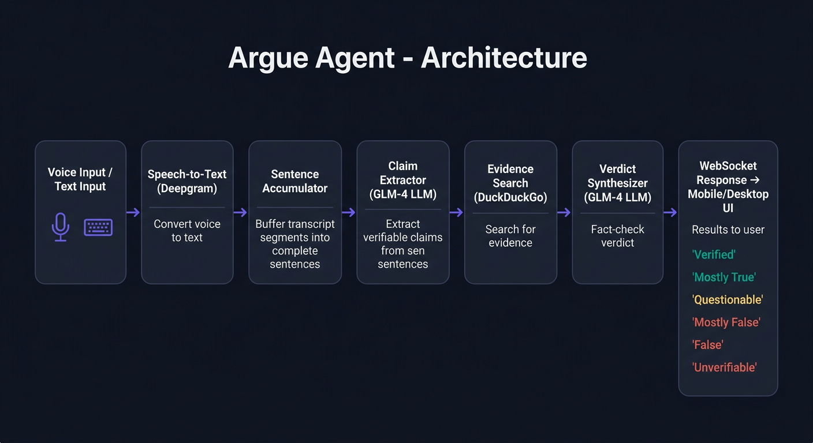
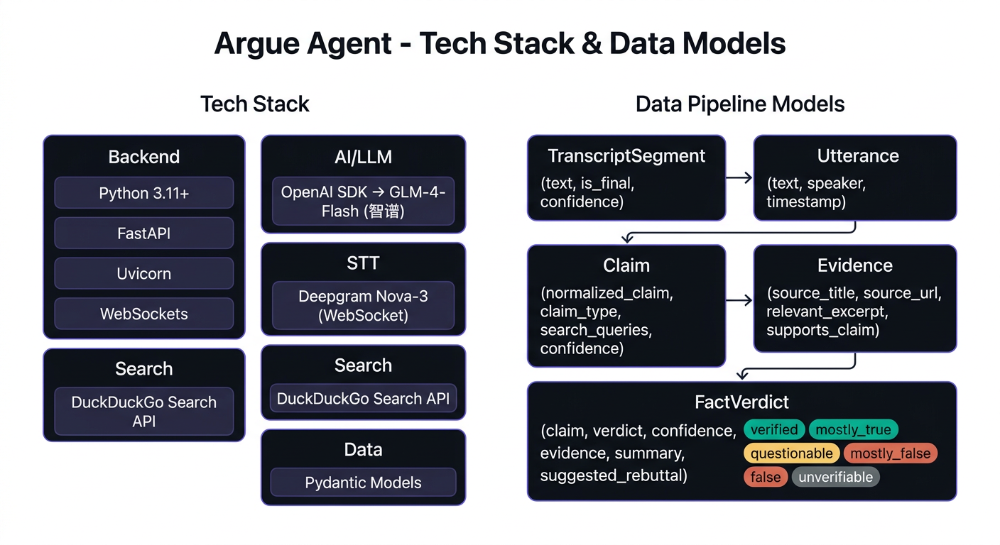
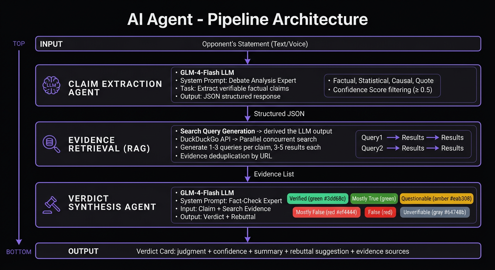
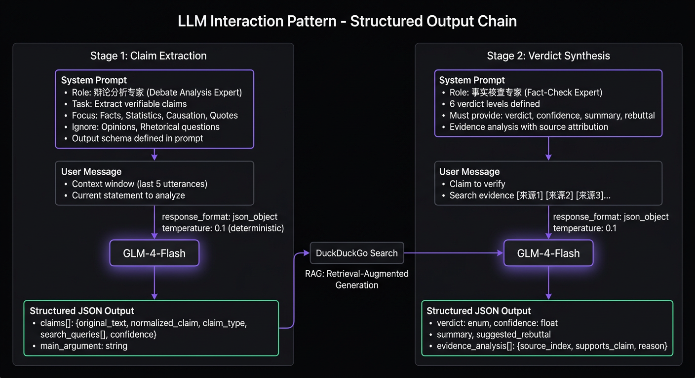
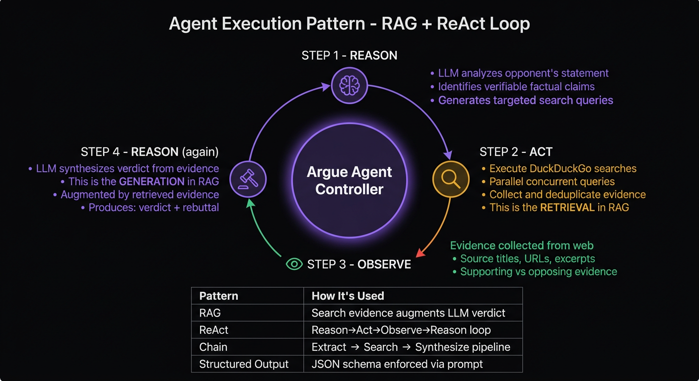
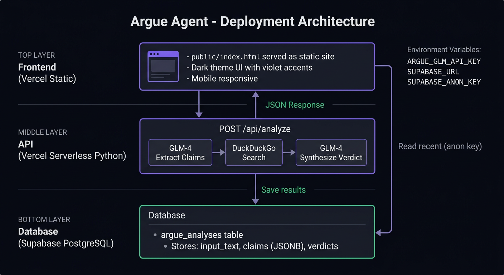

# Argue Agent - 实时辩论助手

> **在线体验**: https://argue-agent.vercel.app

实时监听对话并自动验证对方论点，帮助你在实时沟通中掌握主动权。

## 功能

- **实时语音转录** - 支持中文语音实时转文字（需要 Deepgram API Key）
- **论点提取** - 自动识别对方发言中的可验证论点
- **事实核查** - 通过 DuckDuckGo 搜索验证论点真实性
- **反驳建议** - 生成针对性的反驳或确认建议
- **手机端访问** - 暗色主题，响应式界面，适配手机屏幕

## 架构概览



系统采用流水线架构，从语音/文本输入到最终判定结果，数据经过以下阶段：

1. **语音转文字** - Deepgram Nova-3 实时转录（可选）
2. **断句累积** - 将流式转录片段累积为完整语句
3. **论点提取** - GLM-4 LLM 提取可验证的事实性论点
4. **证据搜索** - DuckDuckGo 并发搜索验证
5. **判定综合** - GLM-4 LLM 综合证据给出 6 级判定

## 技术栈与数据模型



| 层 | 技术 | 说明 |
|---|------|------|
| 后端框架 | FastAPI + Uvicorn | 异步 Web 服务，支持 WebSocket |
| AI/LLM | OpenAI SDK → GLM-4-Flash | 智谱大模型，兼容 OpenAI 接口 |
| 语音识别 | Deepgram Nova-3 | WebSocket 实时流式转录（可选） |
| 搜索引擎 | DuckDuckGo Search | 免费事实验证搜索 |
| 数据验证 | Pydantic v2 | 类型安全的数据模型 |
| 前端 | 原生 JS + CSS | 暗色主题，移动端适配 |

## AI Agent 设计详解

### Agent 管道架构



系统核心是一个三阶段 AI Agent 管道，每个阶段由独立的 Agent 模块负责：

1. **Claim Extractor Agent** — 接收用户输入文本，通过 GLM-4 LLM 以 JSON Schema 约束输出，提取结构化的可验证论点（`Claim` 对象），包含原始文本、规范化表述、论点类型和搜索查询词
2. **Evidence Searcher Agent** — 对每个论点的搜索查询词，通过 DuckDuckGo 并发检索外部证据，返回 `SearchEvidence` 列表
3. **Verdict Synthesizer Agent** — 将论点与证据一并送入 GLM-4 LLM，综合分析后输出 6 级判定（verified → false → unverifiable）及反驳建议

### LLM 交互模式 — 结构化输出链



本项目的 LLM 调用采用 **Structured Output Chain** 模式：

- **System Prompt 定义 JSON Schema** — 通过详细的系统提示词规定输出的 JSON 结构，配合 `response_format: {"type": "json_object"}` 强制 LLM 以 JSON 格式响应
- **两次 LLM 调用，各司其职** — 第一次调用负责提取（Extract），第二次负责综合判定（Synthesize），每次调用都有独立的 System Prompt 和输出 Schema
- **置信度过滤** — 提取阶段输出的 `confidence` 字段用于过滤低置信度论点（阈值 0.5），确保只对有意义的论点进行搜索验证
- **温度控制** — 两次调用均使用 `temperature=0.1`，最大限度降低输出随机性，保证判定结果的稳定性

### Agent 执行模式 — RAG + ReAct



系统融合了两种经典的 AI Agent 设计模式：

**RAG（检索增强生成）**：
- Verdict Synthesizer 不依赖 LLM 的内部知识，而是将外部搜索结果作为上下文注入 Prompt
- 每条证据以 `[来源N] 标题 / 链接 / 内容` 格式结构化呈现，LLM 基于这些实时检索的证据进行判定
- 这确保了判定结果基于最新的外部信息，而非训练数据中的过时知识

**ReAct（推理-行动-观察）循环**：
- **Reason**：LLM 分析输入文本，识别可验证的事实性论点
- **Act**：系统根据提取的搜索查询词，调用 DuckDuckGo 搜索引擎
- **Observe**：收集搜索返回的证据结果
- **Reason**：LLM 再次推理，综合证据与论点，输出最终判定

这种 Reason→Act→Observe→Reason 的循环使得 Agent 能够自主完成从"听到论点"到"给出事实核查结论"的完整推理链。

## 快速开始

### 1. 安装依赖

```bash
cd argue-agent
python -m venv .venv
source .venv/bin/activate
pip install -e .
```

### 2. 配置 API Key

```bash
cp .env.example .env
# 编辑 .env 文件，填入你的 GLM API Key
# ARGUE_GLM_API_KEY=your-glm-api-key-here
```

### 3. 启动服务

```bash
python -m argue_agent
```

### 4. 访问应用

- **电脑浏览器**: http://localhost:8000
- **手机浏览器**: http://<你的局域网IP>:8000

### 5. 使用方式

- **文本模式**: 在输入框中输入对方说的话，点击"发送"
- **语音模式**: 点击麦克风按钮开始录音（需要 Deepgram API Key）

## API Key 获取

| API | 用途 | 获取方式 | 免费额度 |
|-----|------|----------|----------|
| 智谱 GLM | 论点提取、判定 | [智谱开放平台](https://open.bigmodel.cn/) | 新用户赠送 tokens |
| Tavily | 证据搜索（Vercel 部署） | [Tavily](https://tavily.com/) | 1,000 次/月 |
| Deepgram | 语音转文字 | [Deepgram 官网](https://console.deepgram.com/) | $200 额度 |

> **注意**：本地部署使用 DuckDuckGo（免费无需 Key），Vercel 部署使用 Tavily Search API（DuckDuckGo 会屏蔽数据中心 IP）。

## 项目结构

```
argue-agent/
├── pyproject.toml           # 项目配置
├── vercel.json              # Vercel 部署配置
├── requirements.txt         # Vercel Python 依赖
├── Dockerfile               # Docker 部署
├── .env.example             # 配置模板
├── api/
│   └── index.py             # Vercel Serverless API
├── public/
│   └── index.html           # 体验站前端（The Arbiter）
├── docs/images/             # 文档图片
├── src/argue_agent/
│   ├── __main__.py          # 启动入口
│   ├── config.py            # 配置管理（Pydantic Settings）
│   ├── server.py            # FastAPI 服务 + WebSocket
│   ├── analysis/
│   │   ├── models.py        # 数据模型（Claim, Verdict 等）
│   │   ├── extractor.py     # GLM 论点提取
│   │   └── accumulator.py   # 流式断句累积
│   ├── search/
│   │   └── ddg_search.py    # DuckDuckGo 并发搜索
│   ├── verdict/
│   │   └── synthesizer.py   # GLM 判定综合
│   ├── stt/
│   │   ├── base.py          # STT 抽象接口
│   │   └── deepgram_stt.py  # Deepgram WebSocket STT
│   ├── audio/
│   │   └── processor.py     # Float32→Int16 PCM 转换
│   └── web/static/
│       └── index.html       # 响应式暗色主题 UI
└── scripts/
    └── demo_text.py         # 文本模式 CLI 演示
```

## 文本模式测试

不需要语音功能，直接测试核心管道：

```bash
python scripts/demo_text.py
```

输入对方的发言，系统会自动提取论点并搜索验证。

## 部署

### Vercel + Supabase（在线体验站）



体验站采用 Vercel 静态前端 + Serverless Python API + Supabase PostgreSQL 的架构：

```bash
# 安装 Vercel CLI
npm i -g vercel

# 链接项目并部署
vercel link
vercel env add ARGUE_GLM_API_KEY production
vercel env add ARGUE_TAVILY_API_KEY production
vercel env add SUPABASE_URL production
vercel env add SUPABASE_ANON_KEY production
vercel deploy --prod
```

### Docker（本地/服务器）

```bash
docker build -t argue-agent .
docker run -d -p 8000:8000 \
  -e ARGUE_GLM_API_KEY=your-key \
  -e ARGUE_DEEPGRAM_API_KEY=your-key \
  argue-agent
```

## 延迟

从对方说完一句话到看到验证结果，约 3-6 秒：

| 阶段 | 耗时 | 说明 |
|------|------|------|
| 语音转录 | ~300ms | Deepgram 流式识别 |
| 论点提取 | ~1-2s | GLM-4 JSON 结构化输出 |
| 证据搜索 | ~1-2s | DuckDuckGo 并发查询 |
| 判定综合 | ~1-2s | GLM-4 综合分析 |

## 配置项

所有配置通过环境变量设置，前缀为 `ARGUE_`：

| 环境变量 | 默认值 | 说明 |
|----------|--------|------|
| `ARGUE_GLM_API_KEY` | （必填） | 智谱 GLM API Key |
| `ARGUE_TAVILY_API_KEY` | （Vercel 必填） | Tavily Search API Key |
| `ARGUE_DEEPGRAM_API_KEY` | （可选） | Deepgram 语音识别 Key |
| `ARGUE_GLM_MODEL` | `glm-4-flash` | GLM 模型名称 |
| `ARGUE_HOST` | `0.0.0.0` | 监听地址 |
| `ARGUE_PORT` | `8000` | 监听端口 |
| `ARGUE_EXTRACTION_CONFIDENCE_THRESHOLD` | `0.5` | 论点提取置信度阈值 |
| `ARGUE_SEARCH_MAX_QUERIES_PER_CLAIM` | `3` | 每个论点最大搜索查询数 |
| `ARGUE_SEARCH_MAX_RESULTS_PER_QUERY` | `5` | 每次搜索最大结果数 |
